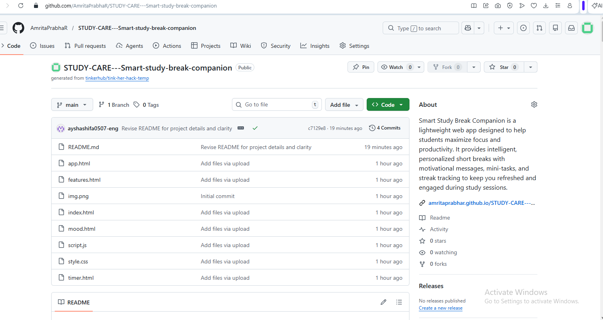
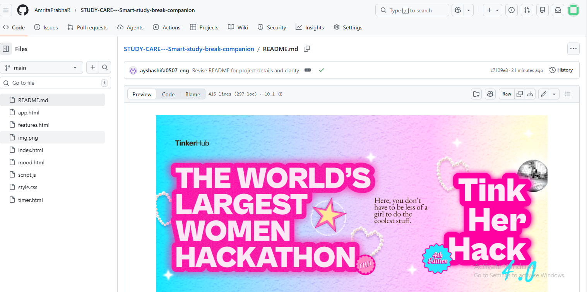
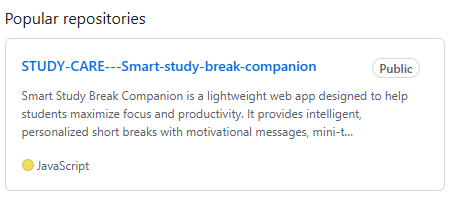
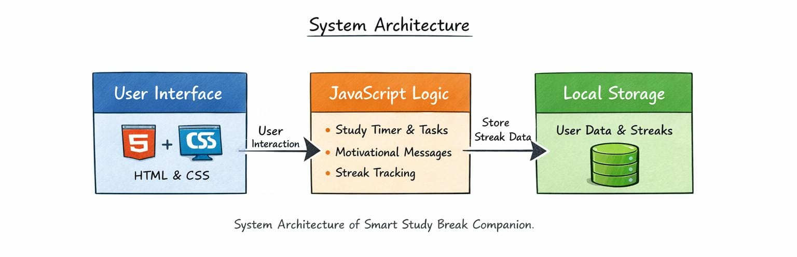
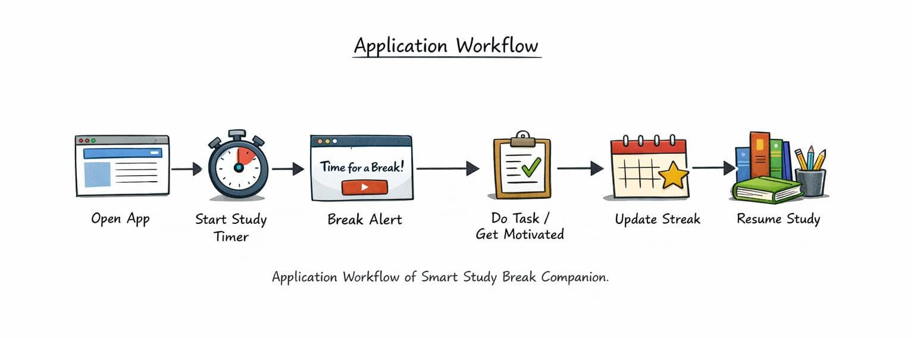

  

# StudyCare Smart Study Break Companion 🎯

## Basic Details

### Team Name: Starzz

### Team Members
- Member 1: Amrita Prabha R - Ilahia College of Engineering and Technology
- Member 2: Aysha Shifa C S - Ilahia College of Engineering and Technology

### Hosted Project Link
https://github.com/AmritaPrabhaR/Smart-study-break-companion/invitations

### Project Description
Smart Study Break Companion is a web app that turns study breaks into refreshing, productive moments. It offers quick activities, motivational prompts, and streak tracking to help students recharge and maintain focus throughout their study sessions.

### The Problem statement
Students often struggle to maintain focus during long study sessions. Traditional study routines can lead to fatigue, loss of motivation, and decreased productivity. There is a need for a tool that encourages effective breaks, refreshes the mind, and helps students stay motivated and consistent in their learning.

### The Solution
Smart Study Break Companion provides a simple, interactive way to take productive breaks during study sessions. It offers short motivational messages, mini tasks to refresh the mind, and streak tracking to encourage consistent focus. By integrating these features, the app helps students recharge, stay motivated, and improve overall productivity.
---

## Technical Details

### Technologies/Components Used

**For Software:**
- Languages used: HTML, CSS, JavaScript
- Frameworks used: None (Vanilla JS, beginner-friendly)
- Libraries used: None (optional: can use libraries like SweetAlert or localStorage for enhancements)
- Tools used: VS Code, Git/GitHub, Web Browser

**For Hardware:**
- Main components: Any computer or laptop with internet access
- Specifications:  No special requirements; runs on modern browsers (Chrome, Edge, Firefox)
- Tools required: None beyond a code editor and browse

---

## Features

List the key features of your project:
- Feature 1: Motivational Messages – Displays short, uplifting messages to keep students motivated during study sessions.
- Feature 2: Suggests small activities or exercises to refresh the mind during breaks.
- Feature 3: Study Timer – Helps manage focused study sessions with customizable timers for work and break intervals.
- Feature 4: Streak Tracking – Tracks consecutive study sessions and breaks to encourage consistency and build productive habits.

---

### For Hardware:

#### Components Required
No additional hardware is needed. The app runs on any standard computer, laptop, or tablet with internet access.

#### Circuit Setup
Not applicable, as this is a software-only project. Simply open the index.html file in a browser to use the app.

---

## Project Documentation

### For Software:

#### Screenshots (Add at least 3)

#### Diagrams

**System Architecture:**

The architecture shows how the UI, logic, and local storage interact to provide a seamless study break experience.

**Application Workflow:**

The workflow illustrates the step-by-step interaction between the user and the app to maintain productivity and motivation.

### For Hardware Projects:

#### Bill of Materials (BOM)

| Component | Quantity | Specifications | Price | Link/Source |
|-----------|----------|----------------|-------|-------------|
| Not required | N/A | N/A | N/A | N/A |

**Total Estimated Cost:** ₹0

## License

This project is licensed under the [LICENSE_NAME] License - see the [LICENSE](LICENSE) file for details.

**Common License Options:**
- MIT License (Permissive, widely used)
- Apache 2.0 (Permissive with patent grant)
- GPL v3 (Copyleft, requires derivative works to be open source)

---

Made with ❤️ at TinkerHub
